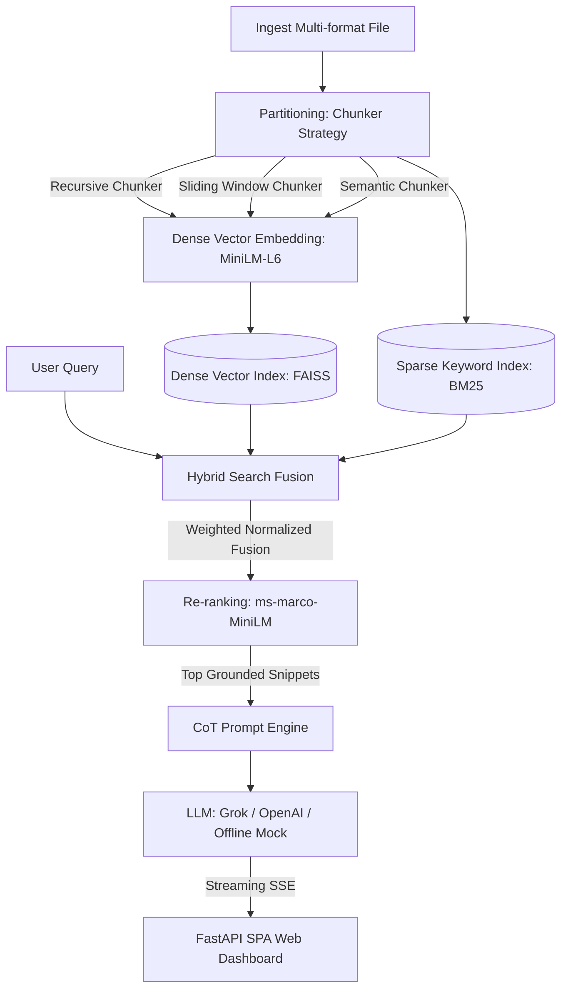

# Intelligent Document Q&A Engine (Project 1)

[](https://fastapi.tiangolo.com)
[](https://github.com/facebookresearch/faiss)
[](https://github.com/dorianbrown/rank_bm25)
[](https://github.com/langchain-ai/langchain)

A production-grade, end-to-end Retrieval-Augmented Generation (RAG) pipeline for multi-format document ingestion, optimized hybrid retrieval, relevance re-ranking, and high-fidelity cited Q&A generation with streaming response support.

---

## ── Architectural Overview ──────────────────────────────────────────



---

## ── Key Features ───────────────────────────────────────────────────

### 📄 Multi-Format Ingestion (US-102 to US-103)
- **PDF Extraction**: Multi-page extraction with structural page indicators and metadata caching.
- **DOCX Parsing**: Extract paragraphs, structural runs, and document properties.
- **Text Normalization**: Automatic chardet encoding detection, BOM stripping, and whitespace consolidation.

### ✂️ Configurable Partitioning (US-104 to US-106)
- **Recursive Character**: Multi-level paragraph-to-word separation hierarchy (standard).
- **Overlapping Sliding Window**: Constant window slides capturing dense boundary contexts.
- **Semantic Breakpoints**: Analyzes sentence embedding similarities locally to split texts exclusively when logical topic changes occur.

### 🧠 High-Fidelity Hybrid Retrieval & Re-ranking (US-115 to US-116)
- **FAISS CPU Dense Search**: Cosine similarity vectors search.
- **BM25 Sparse Keyword Search**: High-recall lexical matches.
- **Normalized Weighted Fusion**: Merges sparse and dense scores using adaptive parameters.
- **Cross-Encoder Re-ranking**: Evaluates retrieved chunks alongside queries using `ms-marco-MiniLM-L-6-v2` for sub-20ms grounded snippet positioning.

### 💬 Cited Streaming Completion (US-109 to US-111)
- **Chain-of-Thought (CoT)**: Prompting forcing the LLM to write out step-by-step reasoning.
- **Strict In-text Footnotes**: Inline source citations referencing the source document and chunk index in brackets `[Source: document.pdf, Chunk: 2]`.
- **Server-Sent Events (SSE)**: Streams text tokens in real-time accompanied by final citations cards JSON.
- **Offline Mock Generator**: Gracefully summarizes contexts and streams answers offline when API keys are absent!

### 📊 Comprehensive Benchmarking & Feedback Loops (US-117 to US-118)
- **Local RAG Evaluator**: Computes BLEU, ROUGE-L, and custom groundedness Faithfulness metrics.
- **SQLite Transaction Database**: Automatically logs query history, ratings, and user-provided corrections.

---

## ── Quick Start ────────────────────────────────────────────────────

### 1. Clone & Install Dependencies
Ensure you have Python 3.10+ installed:
```bash
# Install core and advanced dependencies
pip install -r requirements.txt
```

### 2. Configure Environment Variables
Create a `.env` file in the root directory (based on `.env.example`):
```ini
# LLM Provider: xai | openai | mock
LLM_PROVIDER=mock

# xAI Credentials (Optional)
XAI_API_KEY=your-xai-key-here
XAI_MODEL=grok-2

# OpenAI Credentials (Optional)
OPENAI_API_KEY=your-openai-key-here
OPENAI_MODEL=gpt-4o-mini
```

### 3. Start the Web Dashboard & REST Server
Launch the application:
```bash
python main.py --serve
```
👉 Open **[http://127.0.0.1:8000](http://127.0.0.1:8000)** in your web browser to access the beautiful glassmorphic SPA dashboard!

---

## ── Command Line Interface (CLI) Usage ─────────────────────────────

The engine exposes a highly integrated CLI utility to perform indexing, search, evaluation, and server management.

```bash
# 1. Ingest, chunk, embed, and index a document into the database
python main.py --index -f docs/technical_spec.pdf --chunker semantic

# 2. Ingest with recursive chunker overrides
python main.py --index -f docs/notes.txt --chunker recursive --chunk-size 1000 --chunk-overlap 100

# 3. Direct Q&A command-line search (streams answer and prints source citations)
python main.py --query "What sharding strategy is used to achieve 20,000 writes per second?"

# 4. Trigger quantitative evaluation suite comparing strategies
python main.py --eval
```

---

## ── API Route Specification ────────────────────────────────────────

The FastAPI REST endpoint is fully documented via interactive Swagger UI at `/docs`.

| Method | Endpoint | Description |
| :--- | :--- | :--- |
| `POST` | `/api/ingest` | Uploads and indexes a document. Accepts strategy and size parameters. |
| `POST` | `/api/query` | SSE streaming Q&A query. Streams tokens and yields cited source cards. |
| `POST` | `/api/feedback` | Registers thumbs rating (+1/-1) and user corrections in SQLite. |
| `GET` | `/api/documents` | Lists unique indexed documents and structural chunk statistics. |
| `GET` | `/api/evaluation-metrics` | Returns precomputed strategy benchmarks for visual graphs. |
| `GET` | `/` | Serves the premium SPA dashboard interface. |

---

## ── Premium UI Dashboard Overview ───────────────────────────────

Hosted directly on the root API route, the single-page application (SPA) dashboard features:
1. **Glassmorphism Aesthetic**: Translucent overlay cards, deep indigo/cyan radial glows, and responsive styling.
2. **Real-time Streaming Chat**: Answers render token-by-token with typewriter effects and inline highlighted citations.
3. **Cited Source Card Grid**: Shows clickable document cards. Clicking a card opens a modal showing the exact text snippet referenced.
4. **Ingestion Manager**: Upload files via drag-and-drop and toggle strategies/size parameters interactively.
5. **Interactive Benchmarks**: Integrates visual comparative bars mapping BLEU and groundedness metrics.
6. **SQLite Feedback Integration**: Submit thumbs ratings and text corrections directly beneath answers.
